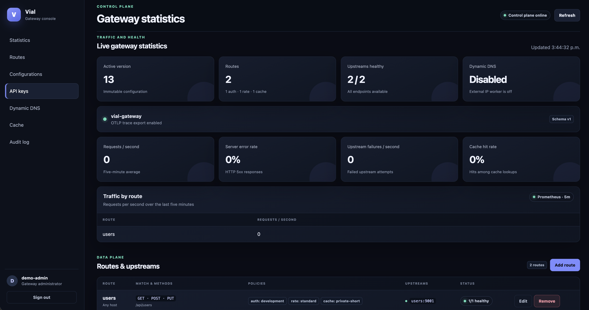

# Vial Gateway

A configuration-driven Go API gateway with an atomically reloadable data plane, Redis-backed control plane, OIDC administration console, resilient upstream routing, distributed traffic policies, caching, transformations, telemetry, and Dynamic DNS.

## Capabilities

- Method, host, and path-prefix routing with rewrites and HTTP/HTTPS upstream pools
- Active health checks, round-robin balancing, idempotent retries, circuit breakers, deadlines, and concurrency limits
- Scoped API keys and JWT/JWKS authentication
- Redis token-bucket rate limits and per-principal GET/HEAD caching
- Bounded header and top-level JSON transformations
- Immutable configuration versions with validation, activation, rollback, deletion, audit, pub/sub, and polling recovery
- OIDC Authorization Code + PKCE admin UI with Redis sessions and CSRF protection
- Prometheus metrics, OTLP/HTTP traces, optional direct TLS reload, and graceful shutdown
- Dynamic public-IP monitoring with provider webhook updates
- Docker Compose and plain Kubernetes deployment examples

## Quick start

Start the complete development stack:

```sh
docker compose --profile demo up --build --detach
./scripts/curl-smoke.sh
```

| Service | Address |
| --- | --- |
| Gateway | `http://127.0.0.1:8080` |
| Admin console | `http://127.0.0.1:8081/admin` |
| Prometheus | `http://127.0.0.1:9090` |
| Tempo | `http://127.0.0.1:3200` |

Development-only credentials:

- Admin: `admin@example.com` / `admin`
- Data-plane API key: `development-only-key`
- Bootstrap admin key: `development-admin-key`

Never reuse these credentials or the bundled OIDC provider outside local development.

## Control  Plane

A UI control plane is available to perfom the most common operations with the gateway



## Documentation

- [Documentation index and architecture](docs/README.md)
- [Configuration reference](docs/configuration.md)
- [Operations guide](docs/operations.md)
- [Docker Compose deployment](docs/deployment/compose.md)
- [Kubernetes deployment](docs/deployment/kubernetes.md)
- [Complete example configuration](config.example.json)

## Local binary

Start Redis and upstream services, then run:

```sh
go run ./cmd/gateway --config config.example.json
```

The process validates the complete configuration before listening. `SIGHUP` stages and activates a replacement route snapshot; invalid configuration or TLS certificate files leave the last-good state active.

## Verify

```sh
go test ./...
go test -race ./...
go vet ./...
golangci-lint run ./...
docker compose config --quiet
```

CI also runs `govulncheck`, container and SBOM scanning, Compose smoke/load checks, and a `kind` deployment smoke test.

## Production note

The checked-in Compose credentials, demo OIDC provider, Kubernetes Secret, Redis deployment, hostnames, and image references are examples. Follow the deployment guides and replace every example value before exposing the gateway.
